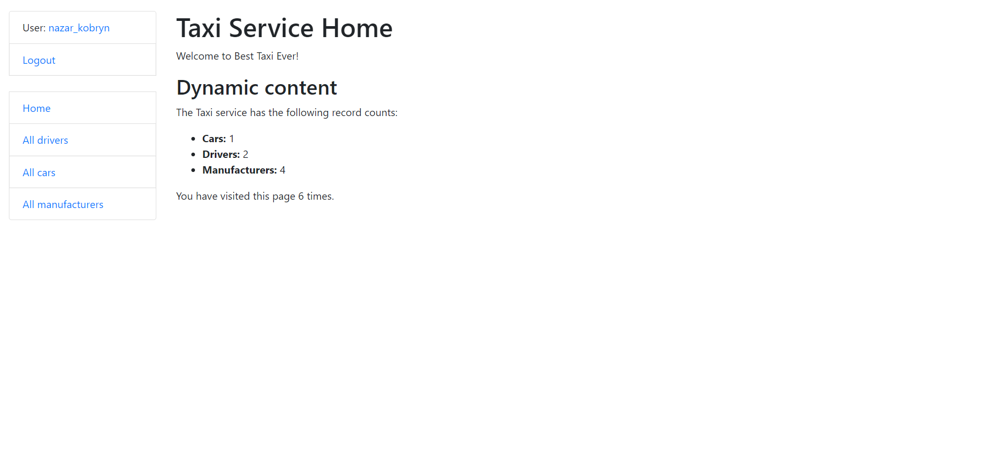
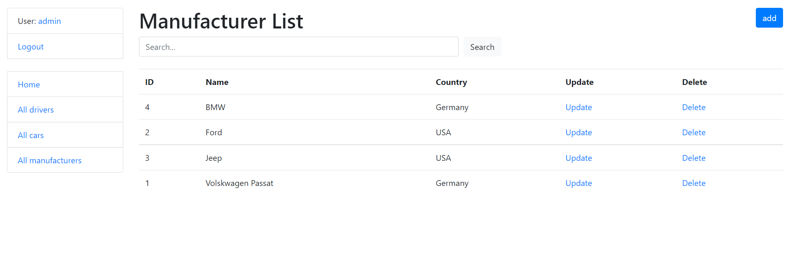

# my taxi service 

Django project for managing cars and drivers in taxi-service application

## Check it out!

[My taxi service project deployed to Heroku](https://taxi-service-nazar-k.herokuapp.com/)

## Installation

Python3 must be already installed

```shell
git clone https://github.com/Nazar-kob/My_taxi_service.git
cd My_taxi_service
python3 -m venv venv
venv\Scripts\activate
pip install -r requirements.txt
python manage.py migrate
python manage.py runserver
```
## Features
 * Authentication functionality for Driver/User
 * Managing cars, manufacturers, drivers directly from website interface
 * Powerful admin panel for advanced managing

## Access
 * Username: nazar_kobryn
 * password: 123qweQWE

## Demo


